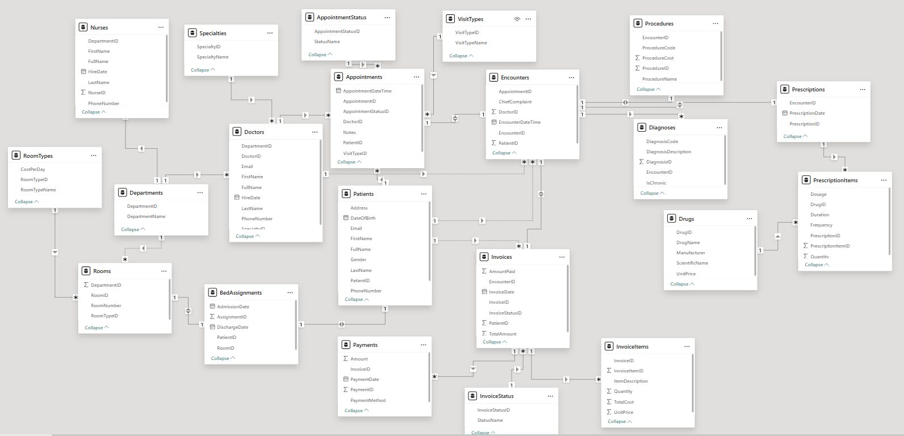

  <h1>🏥 Hospital Database & Analytics | قاعدة بيانات وعروض المستشفى</h1>
  
A Comprehensive Database Design & Power BI Dashboard Project | مشروع تصميم قواعد بيانات متكامل ولوحة معلومات باستخدام Power BI

  
  

    <a href="#english">🇬🇧 English</a> • <a href="#arabic">🇸🇦 العربية</a>
  

  
  
  

---

 

## 📸 Dashboards & Diagrams | المخططات والتقارير

  
  
   
  
  

 

## 🇬🇧 English Documentation

### 📌 About the Project
This project encapsulates the complete lifecycle of designing and implementing a **Hospital Database Management System**. It includes the foundational database analysis, entity-relationship diagrams (ERD), SQL queries, and a fully interactive **Power BI** dashboard to visualize hospital revenues, department performance, and patient statistics.

### 🌟 Deliverables & Features
- **📝 Database Design:** Comprehensive requirements analysis and structural design documents (.docx files).
- **🗃️ ERD Modeling:** A detailed Entity-Relationship Diagram mapping the relational database structure.
- **💻 SQL Implementation:** Scripts for creating the database schema, inserting data, and running complex analytical queries.
- **📊 Power BI Dashboard:** A `.pbix` project file that connects to the data to provide insightful, interactive visual reports on hospital financial growth.

### ⚙️ How to Explore the Project

1. **Documentation:**
   - Read the provided Word documents for insights into the analysis, design phase, and disaster recovery plan.
2. **Database View:**
   - Check the `ERD.png` for a visual understanding of the tables.
   - Explore the `الكويري` (Queries) folder for SQL scripts.
3. **Analytics Dashboard:**
   - Open `مخطط المشروع.pbix` using **Microsoft Power BI Desktop**.
   - Interact with the dashboard to view revenue growth month-by-month and departmental income analysis.

 

---

## 🇸🇦 دليل المشروع (العربية)

### 📌 عن المشروع
يُمثل هذا المشروع دورة الحياة الكاملة لتصميم وبناء **قاعدة بيانات لإدارة المستشفيات**. يشتمل المشروع على التحليل الأساسي، رسم المخطط الكياني العلائقي (ERD)، كتابة أوامر SQL، وبناء لوحة معلومات (Dashboard) تفاعلية بالكامل باستخدام **Power BI** لتحليل وتصور إيرادات المستشفى وأداء الأقسام.

### 🌟 المخرجات والمميزات
- **📝 تصميم قاعدة البيانات:** مستندات نصية تشرح تحليل المتطلبات وتصميم الهيكل العام لقاعدة البيانات.
- **🗃️ مخطط العلاقات (ERD):** رسم توضيحي دقيق يربط الجداول والكيانات في قاعدة البيانات.
- **💻 التنفيذ البرمجي (SQL):** استعلامات لإنشاء الجداول وإدخال البيانات واستخراج التقارير.
- **📊 تحليلات Power BI:** ملف `.pbix` متصل بالبيانات لتقديم تقارير مرئية وتفاعلية حول النمو المالي وتوزع الدخل على أقسام المستشفى.

### ⚙️ كيفية استعراض المشروع

1. **الوثائق والتحليل:**
   - اقرأ ملفات الوورد (Word) المرفقة لمعرفة تفاصيل خطوة التحليل والتصميم وخطة استرجاع البيانات.
2. **قاعدة البيانات:**
   - افتح صورة `ERD.png` لفهم هيكلية الجداول والروابط بينها.
   - راجع مجلد (الكويري) للاطلاع على أكواد الـ SQL.
3. **لوحات المعلومات (Dashboards):**
   - قم بتثبيت برنامج **Microsoft Power BI Desktop**.
   - افتح ملف `مخطط المشروع.pbix` للتفاعل مع المخططات ورؤية إحصائيات الإيرادات.

 

---

  
Built by <b>Waleed Mohsen Al-Ansi</b>

  
📞 +967 773 157 823

